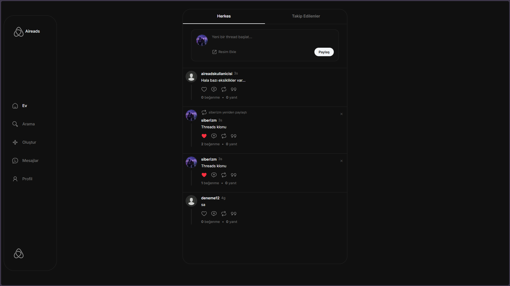
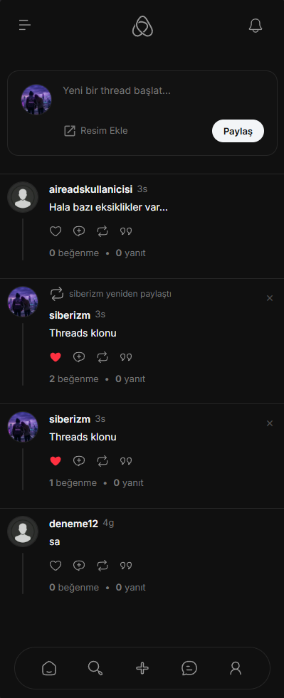
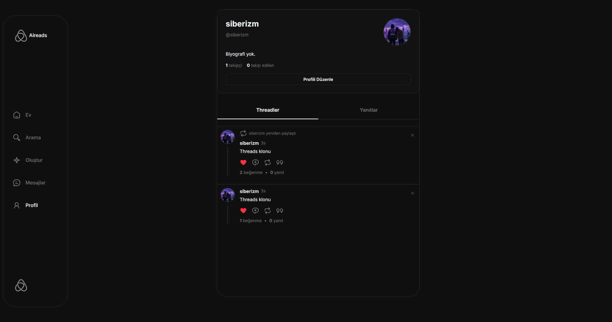
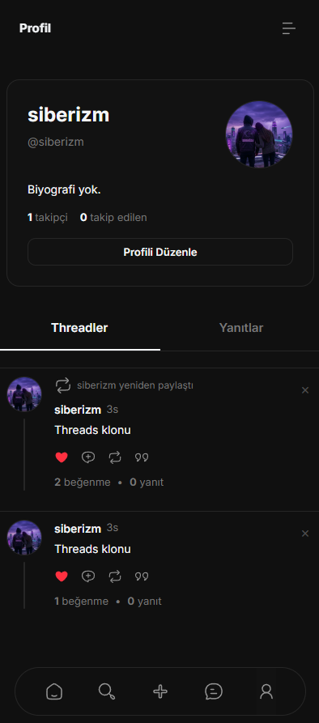
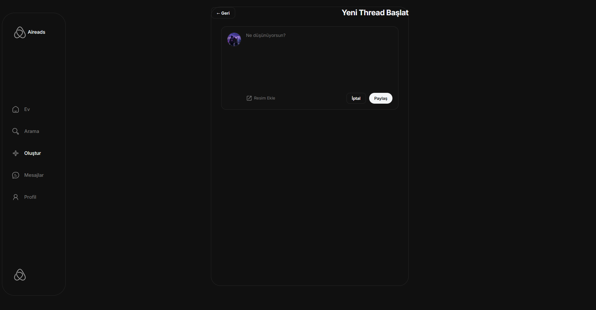
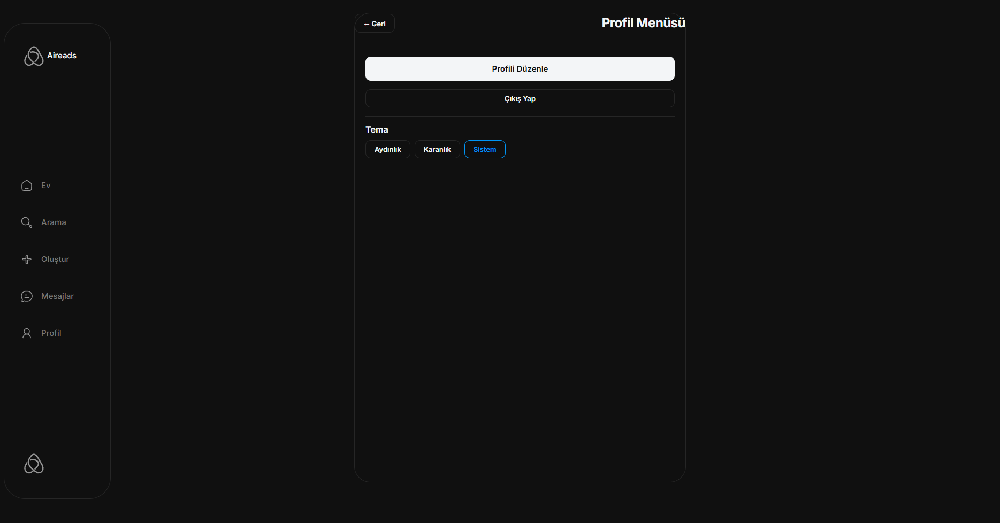
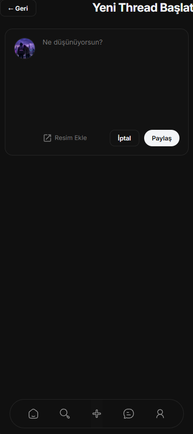
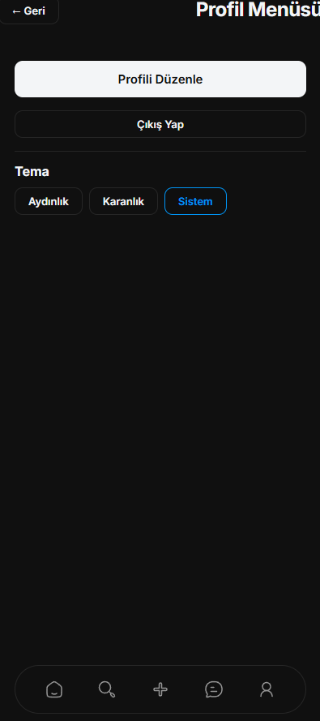
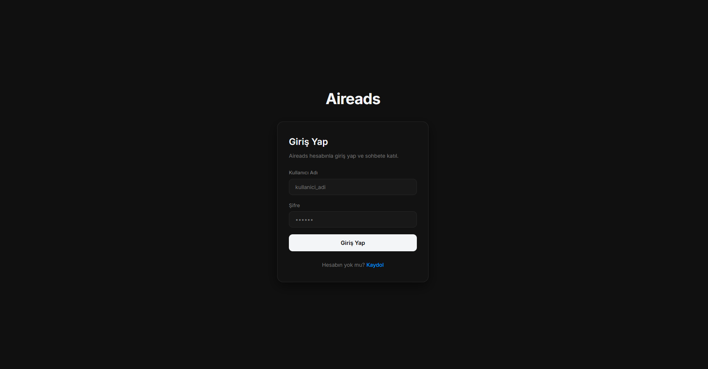

<div align="center">
  
  <h1>🚀 Aireads</h1>
  <p><strong>Modern, hızlı ve dinamik bir Threads klonu.</strong></p>

  <p>
    <a href="#özellikler">Özellikler</a> •
    <a href="#kurulum">Kurulum</a> •
    <a href="#kullanım">Kullanım</a> •
    <a href="#teknolojiler">Teknolojiler</a>
  </p>
</div>

---

## 📸 Ekran Görüntüleri

Projeye ait ekran görüntülerini aşağıda bulabilirsiniz. Masaüstü ve mobil görünümler desteklenmektedir. İlgili resimleri `screenshots` klasörüne eklemeyi unutmayın!

### 🏠 Ana Sayfa & Keşfet
<div align="center">
  
</div>
<div align="center">
  
</div>

### 👤 Profil
<div align="center">
  
</div>
<div align="center">
  
</div>

### ✍️ Yeni Gönderi & ⚙️ Ayarlar
<div align="center">
  
  
</div>
<div align="center">
  
  
</div>

### 🔐 Giriş / Kayıt Sayfası
<div align="center">
  
</div>
<div align="center">
  
</div>

<br/>

## ✨ Özellikler

- **Gerçek Zamanlı İletişim:** Socket.io ile anlık mesajlaşma ve bildirimler.
- **Kullanıcı Kimlik Doğrulaması:** Güvenli giriş ve kayıt sistemi (Bcrypt).
- **Medya Yükleme:** Multer destekli fotoğraf ve dosya paylaşımı.
- **Responsive Tasarım:** Hem mobil hem de masaüstü cihazlar için mükemmel uyumluluk.
- **Güçlü Veritabanı:** Esnek ve hızlı veri yönetimi.

---

## 🛠️ Kurulum

Projeyi yerel ortamınızda çalıştırmak için aşağıdaki adımları izleyin.

### Gereksinimler

- [Node.js](https://nodejs.org/) (v16 veya daha yeni bir sürüm)
- [NPM](https://www.npmjs.com/) (Node.js ile birlikte gelir)

### Adımlar

1. **Repoyu Klonlayın**
   ```bash
   git clone https://github.com/kullaniciadi/aireads.git
   cd aireads
   ```

2. **Bağımlılıkları Yükleyin**
   ```bash
   npm install
   ```

3. **Veritabanı Dosyasını Oluşturun**
   Proje ana dizininde bir `database.sqlite` dosyası oluşturulmalı. Otomatik oluşmamışsa elle oluşturabilirsiniz. Veritabanı bağlantı ayarlarını `database.js` dosyasında kontrol edebilirsiniz.

---

## 🚀 Kullanım

Kurulum tamamlandıktan sonra uygulamayı başlatmak için:

### Geliştirme Modu
Uygulamayı geliştirme modunda başlatmak için:
```bash
npm run dev
```

### Üretim Modu
Uygulamayı normal şekilde başlatmak için:
```bash
npm start
```

Uygulama başarıyla başlatıldığında tarayıcınızdan **`http://localhost:3000`** adresine giderek erişebilirsiniz.

---

## 💻 Teknolojiler

Bu proje aşağıdaki modern web teknolojileri kullanılarak geliştirilmiştir:

- **Backend:** Node.js, Express.js
- **Veritabanı:** SQLite / PostgreSQL (pg)
- **Gerçek Zamanlı:** Socket.io
- **Güvenlik & Oturum:** bcryptjs, express-session
- **Dosya Yükleme:** Multer

---

<div align="center">
  <i>Siberizm tarafından Vibe Coding ile geliştirildi.</i>
</div>
